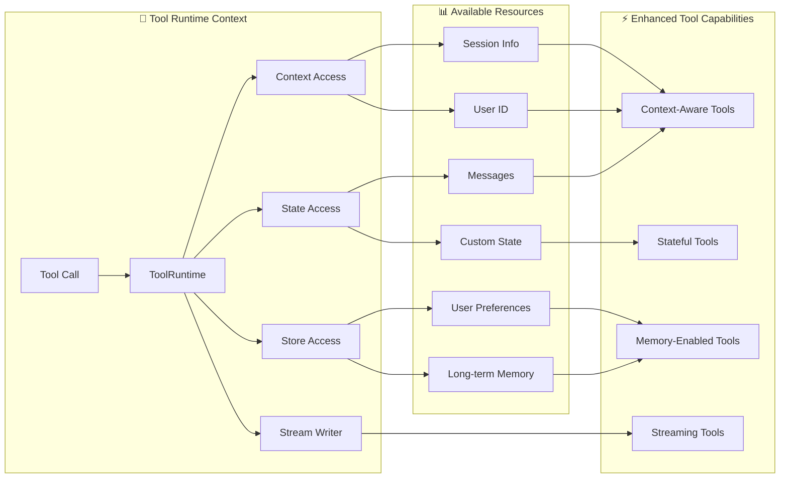

Many AI applications interact with users via natural language. However, some use cases require models to interface directly with external systems—such as APIs, databases, or file systems—using structured input.

Tools are components that [agents](/oss/langchain/agents) call to perform actions. They extend model capabilities by letting them interact with the world through well-defined inputs and outputs.

Tools encapsulate a callable function and its input schema. These can be passed to compatible [chat models](/oss/langchain/models), allowing the model to decide whether to invoke a tool and with what arguments. In these scenarios, tool calling enables models to generate requests that conform to a specified input schema.

<Note>
**Server-side tool use**

Some chat models (e.g., [OpenAI](/oss/integrations/chat/openai), [Anthropic](/oss/integrations/chat/anthropic), and [Gemini](/oss/integrations/chat/google_generative_ai)) feature [built-in tools](/oss/langchain/models#server-side-tool-use) that are executed server-side, such as web search and code interpreters. Refer to the [provider overview](/oss/integrations/providers/overview) to learn how to access these tools with your specific chat model.
</Note>

## Create tools

### Basic tool definition

:::python
The simplest way to create a tool is with the @[`@tool`] decorator. By default, the function's docstring becomes the tool's description that helps the model understand when to use it:

```python
from langchain.tools import tool

@tool
def search_database(query: str, limit: int = 10) -> str:
    """Search the customer database for records matching the query.

    Args:
        query: Search terms to look for
        limit: Maximum number of results to return
    """
    return f"Found {limit} results for '{query}'"
```

Type hints are **required** as they define the tool's input schema. The docstring should be informative and concise to help the model understand the tool's purpose.
:::

:::js
The simplest way to create a tool is by importing the `tool` function from the `langchain` package. You can use [zod](https://zod.dev/) to define the tool's input schema:

```ts
import * as z from "zod"
import { tool } from "langchain"

const searchDatabase = tool(
  ({ query, limit }) => `Found ${limit} results for '${query}'`,
  {
    name: "search_database",
    description: "Search the customer database for records matching the query.",
    schema: z.object({
      query: z.string().describe("Search terms to look for"),
      limit: z.number().describe("Maximum number of results to return"),
    }),
  }
);
```
:::

:::python
### Customize tool properties

#### Custom tool name

By default, the tool name comes from the function name. Override it when you need something more descriptive:

```python
@tool("web_search")  # Custom name
def search(query: str) -> str:
    """Search the web for information."""
    return f"Results for: {query}"

print(search.name)  # web_search
```

#### Custom tool description

Override the auto-generated tool description for clearer model guidance:

```python
@tool("calculator", description="Performs arithmetic calculations. Use this for any math problems.")
def calc(expression: str) -> str:
    """Evaluate mathematical expressions."""
    return str(eval(expression))
```

### Advanced schema definition

Define complex inputs with Pydantic models or JSON schemas:

<CodeGroup>
    ```python Pydantic model
    from pydantic import BaseModel, Field
    from typing import Literal

    class WeatherInput(BaseModel):
        """Input for weather queries."""
        location: str = Field(description="City name or coordinates")
        units: Literal["celsius", "fahrenheit"] = Field(
            default="celsius",
            description="Temperature unit preference"
        )
        include_forecast: bool = Field(
            default=False,
            description="Include 5-day forecast"
        )

    @tool(args_schema=WeatherInput)
    def get_weather(location: str, units: str = "celsius", include_forecast: bool = False) -> str:
        """Get current weather and optional forecast."""
        temp = 22 if units == "celsius" else 72
        result = f"Current weather in {location}: {temp} degrees {units[0].upper()}"
        if include_forecast:
            result += "\nNext 5 days: Sunny"
        return result
    ```

    ```python JSON Schema
    weather_schema = {
        "type": "object",
        "properties": {
            "location": {"type": "string"},
            "units": {"type": "string"},
            "include_forecast": {"type": "boolean"}
        },
        "required": ["location", "units", "include_forecast"]
    }

    @tool(args_schema=weather_schema)
    def get_weather(location: str, units: str = "celsius", include_forecast: bool = False) -> str:
        """Get current weather and optional forecast."""
        temp = 22 if units == "celsius" else 72
        result = f"Current weather in {location}: {temp} degrees {units[0].upper()}"
        if include_forecast:
            result += "\nNext 5 days: Sunny"
        return result
    ```
</CodeGroup>

### Reserved argument names

The following parameter names are reserved and cannot be used as tool arguments. Using these names will cause runtime errors.

| Parameter name | Purpose |
|----------------|---------|
| `config` | Reserved for passing `RunnableConfig` to tools internally |
| `runtime` | Reserved for `ToolRuntime` parameter (accessing state, context, store) |

To access runtime information, use the @[`ToolRuntime`] parameter instead of naming your own arguments `config` or `runtime`.
:::

## Accessing Context

<Info>
**Why this matters:** Tools are most powerful when they can access agent state, runtime context, and long-term memory. This enables tools to make context-aware decisions, personalize responses, and maintain information across conversations.

:::python
Runtime context provides a way to inject dependencies (like database connections, user IDs, or configuration) into your tools at runtime, making them more testable and reusable.
:::

:::js
The runtime context provides a structured way to supply runtime data, such as DB connections, user IDs, or config, into your tools. This avoids global state and keeps tools testable and reusable.
:::
</Info>

:::python
Tools can access runtime information through the `ToolRuntime` parameter, which provides:

- **State** - Mutable data that flows through execution (e.g., messages, counters, custom fields)
- **Context** - Immutable configuration like user IDs, session details, or application-specific configuration
- **Store** - Persistent long-term memory across conversations
- **Stream Writer** - Stream custom updates as tools execute
- **Config** - `RunnableConfig` for the execution
- **Tool Call ID** - ID of the current tool call



### `ToolRuntime`

Use `ToolRuntime` to access all runtime information in a single parameter. Simply add `runtime: ToolRuntime` to your tool signature, and it will be automatically injected without being exposed to the LLM.

<Info>
**`ToolRuntime`**: A unified parameter that provides tools access to state, context, store, streaming, config, and tool call ID. This replaces the older pattern of using separate @[`InjectedState`], @[`InjectedStore`], @[`get_runtime`], and @[`InjectedToolCallId`] annotations.

The runtime automatically provides these capabilities to your tool functions without you having to pass them explicitly or use global state.
</Info>

**Accessing state:**

Tools can access the current graph state using `ToolRuntime`:

```python
from langchain.tools import tool, ToolRuntime

# Access the current conversation state
@tool
def summarize_conversation(
    runtime: ToolRuntime
) -> str:
    """Summarize the conversation so far."""
    messages = runtime.state["messages"]

    human_msgs = sum(1 for m in messages if m.__class__.__name__ == "HumanMessage")
    ai_msgs = sum(1 for m in messages if m.__class__.__name__ == "AIMessage")
    tool_msgs = sum(1 for m in messages if m.__class__.__name__ == "ToolMessage")

    return f"Conversation has {human_msgs} user messages, {ai_msgs} AI responses, and {tool_msgs} tool results"

# Access custom state fields
@tool
def get_user_preference(
    pref_name: str,
    runtime: ToolRuntime  # ToolRuntime parameter is not visible to the model
) -> str:
    """Get a user preference value."""
    preferences = runtime.state.get("user_preferences", {})
    return preferences.get(pref_name, "Not set")
```

<Warning>
The `tool_runtime` parameter is hidden from the model. For the example above, the model only sees `pref_name` in the tool schema - `tool_runtime` is *not* included in the request.
</Warning>

**Updating state:**

Use @[`Command`] to update the agent's state or control the graph's execution flow:

```python
from langgraph.types import Command
from langchain.messages import RemoveMessage
from langgraph.graph.message import REMOVE_ALL_MESSAGES
from langchain.tools import tool, ToolRuntime

# Update the conversation history by removing all messages
@tool
def clear_conversation() -> Command:
    """Clear the conversation history."""

    return Command(
        update={
            "messages": [RemoveMessage(id=REMOVE_ALL_MESSAGES)],
        }
    )

# Update the user_name in the agent state
@tool
def update_user_name(
    new_name: str,
    runtime: ToolRuntime
) -> Command:
    """Update the user's name."""
    return Command(update={"user_name": new_name})
```
:::

#### Context

:::python
Access immutable configuration and contextual data like user IDs, session details, or application-specific configuration through `runtime.context`.

Tools can access runtime context through `ToolRuntime`:

```python
from dataclasses import dataclass
from langchain_openai import ChatOpenAI
from langchain.agents import create_agent
from langchain.tools import tool, ToolRuntime


USER_DATABASE = {
    "user123": {
        "name": "Alice Johnson",
        "account_type": "Premium",
        "balance": 5000,
        "email": "alice@example.com"
    },
    "user456": {
        "name": "Bob Smith",
        "account_type": "Standard",
        "balance": 1200,
        "email": "bob@example.com"
    }
}

@dataclass
class UserContext:
    user_id: str

@tool
def get_account_info(runtime: ToolRuntime[UserContext]) -> str:
    """Get the current user's account information."""
    user_id = runtime.context.user_id

    if user_id in USER_DATABASE:
        user = USER_DATABASE[user_id]
        return f"Account holder: {user['name']}\nType: {user['account_type']}\nBalance: ${user['balance']}"
    return "User not found"

model = ChatOpenAI(model="gpt-4o")
agent = create_agent(
    model,
    tools=[get_account_info],
    context_schema=UserContext,
    system_prompt="You are a financial assistant."
)

result = agent.invoke(
    {"messages": [{"role": "user", "content": "What's my current balance?"}]},
    context=UserContext(user_id="user123")
)
```
:::

:::js
Tools can access an agent's runtime context through the `config` parameter:

```ts
import * as z from "zod"
import { ChatOpenAI } from "@langchain/openai"
import { createAgent } from "langchain"

const getUserName = tool(
  (_, config) => {
    return config.context.user_name
  },
  {
    name: "get_user_name",
    description: "Get the user's name.",
    schema: z.object({}),
  }
);

const contextSchema = z.object({
  user_name: z.string(),
});

const agent = createAgent({
  model: new ChatOpenAI({ model: "gpt-4o" }),
  tools: [getUserName],
  contextSchema,
});

const result = await agent.invoke(
  {
    messages: [{ role: "user", content: "What is my name?" }]
  },
  {
    context: { user_name: "John Smith" }
  }
);
```
:::

#### Memory (Store)

:::python
Access persistent data across conversations using the store. The store is accessed via `runtime.store` and allows you to save and retrieve user-specific or application-specific data.

Tools can access and update the store through `ToolRuntime`:

```python expandable
from typing import Any
from langgraph.store.memory import InMemoryStore
from langchain.agents import create_agent
from langchain.tools import tool, ToolRuntime


# Access memory
@tool
def get_user_info(user_id: str, runtime: ToolRuntime) -> str:
    """Look up user info."""
    store = runtime.store
    user_info = store.get(("users",), user_id)
    return str(user_info.value) if user_info else "Unknown user"

# Update memory
@tool
def save_user_info(user_id: str, user_info: dict[str, Any], runtime: ToolRuntime) -> str:
    """Save user info."""
    store = runtime.store
    store.put(("users",), user_id, user_info)
    return "Successfully saved user info."

store = InMemoryStore()
agent = create_agent(
    model,
    tools=[get_user_info, save_user_info],
    store=store
)

# First session: save user info
agent.invoke({
    "messages": [{"role": "user", "content": "Save the following user: userid: abc123, name: Foo, age: 25, email: foo@langchain.dev"}]
})

# Second session: get user info
agent.invoke({
    "messages": [{"role": "user", "content": "Get user info for user with id 'abc123'"}]
})
# Here is the user info for user with ID "abc123":
# - Name: Foo
# - Age: 25
# - Email: foo@langchain.dev
```
:::

:::js
Access persistent data across conversations using the store. The store is accessed via `config.store` and allows you to save and retrieve user-specific or application-specific data.

```ts expandable
import * as z from "zod";
import { createAgent, tool } from "langchain";
import { InMemoryStore } from "@langchain/langgraph";
import { ChatOpenAI } from "@langchain/openai";

const store = new InMemoryStore();

// Access memory
const getUserInfo = tool(
  async ({ user_id }) => {
    const value = await store.get(["users"], user_id);
    console.log("get_user_info", user_id, value);
    return value;
  },
  {
    name: "get_user_info",
    description: "Look up user info.",
    schema: z.object({
      user_id: z.string(),
    }),
  }
);

// Update memory
const saveUserInfo = tool(
  async ({ user_id, name, age, email }) => {
    console.log("save_user_info", user_id, name, age, email);
    await store.put(["users"], user_id, { name, age, email });
    return "Successfully saved user info.";
  },
  {
    name: "save_user_info",
    description: "Save user info.",
    schema: z.object({
      user_id: z.string(),
      name: z.string(),
      age: z.number(),
      email: z.string(),
    }),
  }
);

const agent = createAgent({
  model: new ChatOpenAI({ model: "gpt-4o" }),
  tools: [getUserInfo, saveUserInfo],
  store,
});

// First session: save user info
await agent.invoke({
  messages: [
    {
      role: "user",
      content: "Save the following user: userid: abc123, name: Foo, age: 25, email: foo@langchain.dev",
    },
  ],
});

// Second session: get user info
const result = await agent.invoke({
  messages: [
    { role: "user", content: "Get user info for user with id 'abc123'" },
  ],
});

console.log(result);
// Here is the user info for user with ID "abc123":
// - Name: Foo
// - Age: 25
// - Email: foo@langchain.dev
```
:::

#### Stream Writer

:::python
Stream custom updates from tools as they execute using `runtime.stream_writer`. This is useful for providing real-time feedback to users about what a tool is doing.

```python
from langchain.tools import tool, ToolRuntime

@tool
def get_weather(city: str, runtime: ToolRuntime) -> str:
    """Get weather for a given city."""
    writer = runtime.stream_writer

    # Stream custom updates as the tool executes
    writer(f"Looking up data for city: {city}")
    writer(f"Acquired data for city: {city}")

    return f"It's always sunny in {city}!"
```

<Note>
If you use `runtime.stream_writer` inside your tool, the tool must be invoked within a LangGraph execution context. See [Streaming](/oss/langchain/streaming) for more details.
</Note>
:::

:::js
Stream custom updates from tools as they execute using `config.streamWriter`. This is useful for providing real-time feedback to users about what a tool is doing.

```ts
import * as z from "zod";
import { tool } from "langchain";

const getWeather = tool(
  ({ city }, config) => {
    const writer = config.streamWriter;

    // Stream custom updates as the tool executes
    writer(`Looking up data for city: ${city}`);
    writer(`Acquired data for city: ${city}`);

    return `It's always sunny in ${city}!`;
  },
  {
    name: "get_weather",
    description: "Get weather for a given city.",
    schema: z.object({
      city: z.string(),
    }),
  }
);
```
:::
